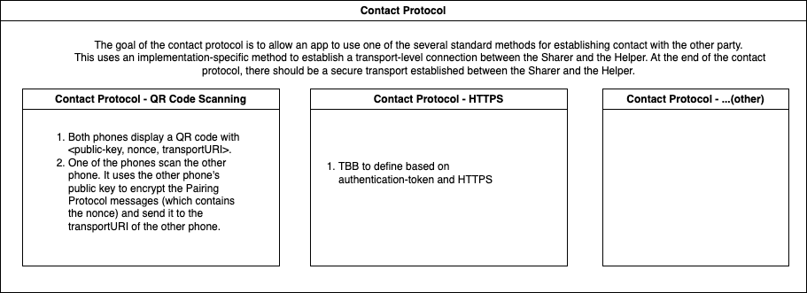
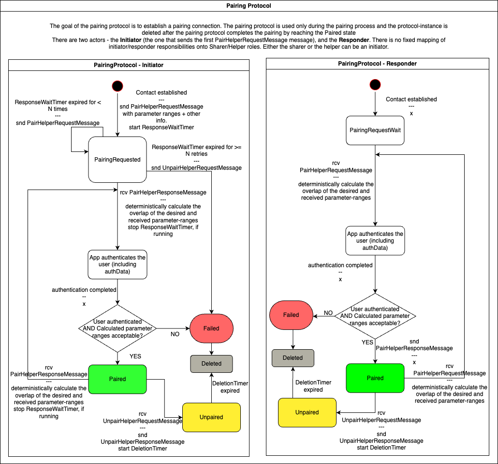
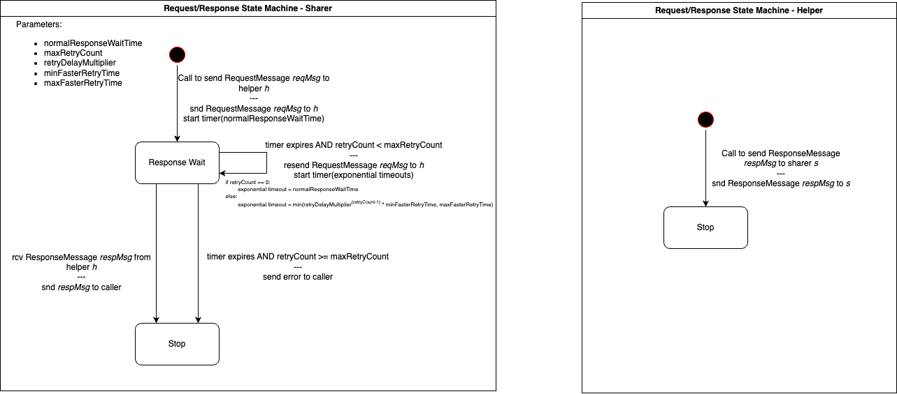

# DeRec Protocol

Digital assets are typically protected using secrets, such as passwords or cryptographic keys. However, for a typical user, managing secrets remains cumbersome and error-prone. Not only must the user maintain backups of the secret to avoid losing assets in the event of device loss or malfunction, but the user must also ensure the safety of each backup to avoid being accessed by attackers. DeRec is a novel protocol for secrets management based on secret-sharing amongst a set of helpers (e.g. friends or multiple custody services), who can assist the user to recover their secret when needed. Each helper's share reveals no information about the original secret, and a threshold number of helpers (e.g. half) can be combined to reconstruct the secret. This document covers the different sub-protocols of DeRec: 1) pairing between helpers to establish a secure channel; 2) mechanism for generating and distributing shares of the user's secret; 3) periodic checks on helpers to ensure their ability to assist in recovery; and 4) the recovery protocol.

##  Protocol Overview

Decentralized recovery is a method of safeguarding a user's secret by distributing shares of that secret among multiple helpers, who store their individual share on their local device in order to help the user recover that secret in future. The shares are constructed under a threshold secret-sharing scheme (e.g. Shamir's secret sharing scheme), with a chosen threshold (defaults to half) -- at least three helpers must be present in order to use the protocol. Should the user lose access to their device, they can recover their secret data by retrieving the previously-distributed shares from at least half of their helpers. For successful recovery, the user only needs to recall the identities of half of their helpers and authenticate with them in-person.

From here on, we will refer to the user that is sharing a secret as a sharer, and the party that has agreed to hold onto a share as the helper. Note that there is no communication between helpers, and the helpers are oblivious of each other (and even the total number of helpers protecting a secret). All communication between a sharer and a helper occurs over a secure channel, where each message is signed-then-encrypted -- here, the signature also covers the identity of the message sender and receiver -- using cryptographic keys that are exchanged during a (in-person) pairing protocol. That is, we perform a trusted setup where the parties can exchange public signature and encryption keys, thus giving us a public key infrastructure.

For simplicity, we will consider a single instance of the DeRec protocol to only protect one secret. The secret can have arbitrary length, thus making DeRec applicable to several use cases, from protecting root keys for cryptocurrency wallets and password managers to file storage. A secret is shared by first encrypting it with a random key (using AES-GCM, for instance), and then generating shares of the key using (verifiable) Shamir secret sharing. Specifically, each share consists of the encrypted secret (i.e., the AES-encrypted ciphertext), a Shamir share of encryption key, and some authentication data that the sharer can use to verify the authenticity of the share during recovery -- note that, depending on the setting, the encrypted secret data need not be replicated at all helpers. The authentication data is construction-specific (described later), but it will typically include a vector commitment to all shares, and an opening that can be used to verify the contents of the share with respect to the commitment; the commitment will be replicated amongst all helpers, and a majority-rule can be applied to determine the correct commitment during recovery.

After pairing, a sharer may contact the helper to store a share of the secret. If the secret is modified, or if the helper set is changed to add or exclude a helper, then new shares are generated and transmitted to all helpers; as a result, each share is annotated with a version. Moreover, it is important to ensure that a helper is maintaining the correct share, to reduce the likelihood that corruptions or unwillingness to help cause a failure during recovery. To that end, the sharer periodically requests the helper to verify that they are holding the correct share, via a challenge-response mechanism. For each of these interactions, communication is initiated by the sharer, and the helper is expected to reply within a specified time duration; after sufficient retries, the sharer may give up on the helper, and choose to exclude it from the helper set.

A sharer will typically enter recovery mode when they have lost their devices. For recovery, the sharer must recollect the identity of at least a threshold number of helpers, and pair with them again (in person) in order to exchange public key material for forming a secure communication channel. During recovery, the helper has the option to identify the sharer as an existing user in their contact list, and transmit any share that they may be previously holding for that user. Once a threshold number of shares are collected, the recovering sharer can verify their correctness -- recall that a threshold number of shares are required to determine the correct vector commitment against which to verify any share -- and run the Shamir reconstruction algorithm to derive the encryption key, and then decrypt the ciphertext using that key. If the helpers are acting maliciously, they may send incorrect shares to the recovering sharer; in this case, the sharer must continue pairing and collecting shares until it has a threshold number of shares (of the same version).


### Security and Privacy Guarantees

The DeRec protocol provides the following guarantees:

* privacy: as long as fewer than a threshold number of helpers are corrupt, the sharer's secret and helper set (number of helpers and their identity) remain private;
* liveness: if sufficient number of helpers are available during recovery such that the sharer can access a threshold number of uncorrupted shares of some version, then the recovery process terminates;
* correctness: on termination, the recovery process will output the correct secret value that was shared (for the version that was reconstructed);

## Protocol Details

We elaborate on the core sub-protocols within DeRec: pairing, sharing, verification, and recovery.

### Pairing
For pairing, there must be a transfer of a "contact" before the protocol begins. This includes one party's encryption key, the URI to use for the protocol, and a nonce to identify this pairing. The "initiator" then sends a pairing message, and the "responder" sends a response. At that point, the two parties are now paired. The initiator can be either the sharer or helper, and the responder will be the other party. 

The initiator creates a Pair Request message, signs the message with their private signature key and encrypts the message using the responder's public encryption key.

When the initiator sends the pair request message, the responder initially doesn't know the initiator's public key at this stage. So they can't do anything with the sender hash immediately, though they can verify the receiver hash using their own public encryption key.

The responder decrypts the message using their private encryption key but can't verify the sender's signature yet, as they don't have a sender signature public key.

The initiator's public keys (for encryption and signature) are both present in the pair message, so the the receiver can belatedly a) assess the SHA-384 hash they just received. b) assess the signature.

The responder then replies with a Pair Reply message. They sign with their private signature key and encrypt it with the initiator's public encryption key.

The initiator decrypts the message with their encryption private key but can only assess the signature having deserialised the pair response message.

After pairing for a given secret ID, for all future messages for that secret ID, the receiver of a message can both decrypt and verify the signature on each message as it is received.

### Sharing

On creating a secret or later modifying its value, the sharer creates new shares to distribute to the helpers. New shares are also created when the set of helpers is modified, say to add or remove a helper.

As mentioned above, to support secrets of arbitrary length, we use hybrid encryption where the secret data is encrypted under AES-GCM, while the AES key is secret-shared amongst the helpers -- the encrypted ciphertext can be replicated amongst some or all of the helpers.

Moreover, to enable verifiable recovery -- verifiability means that we can identify incorrect shares and recover the correct AES key when given a threshold number of correct shares -- we attach authentication data to each individual share. To that end, we use a vector commitment scheme to commit to the list of all shares, and attach an opening proof for each share. Specically, we use a Merkle tree based vector commitment, where the leaves of the Merkle tree are SHA-384 hashes of all shares, and the root of the Merkle tree acts as the vector commitment; the opening proof for any share is a Merkle path, comprising of sibling nodes along the path from the leaf node to the root. During recovery, with an opening proof accompanying each share, the recovering user can recompute hashes and check that the recomputed root hash equals the expected Merkle tree root.

There is a caveat that verifying an opening proof requires the user to know the expected Merkle tree root, which is not a valid assumption during recovery as the user does not have any prior state. To address this potential issue, we also replicate the Merkle tree root value with each share. Recovery now uses a majority rule to determine the correct Merkle tree root amongst all the received shares.

The sharing algorithm implements the following pseudo-code:
```
// t: reconstruction threshold
// n: total number of helpers
// secret: byte array holding the secret data
// seed: 256-bit PRNG seed value
share(t, n, secret, seed):
	prng := create_prng_extractor(seed); //cryptographic PRNG
	key := extract(prng, 256); //extract 256 bits
	ctxt := aes_gcm_encrypt(key, msg); //AES-GCM ciphertext
	for i in [1..t]: //sample t random field elements
		a_i = extract(prng, 256);
	a_0 := key;
	//define polynomial with input coefficients
	f := create_polynomial([a_0, ..., a_t]);
	for i in [1..n]:
		x_i := extract(prng, 256);
		y_i := evaluate_polynomial(f, x_i);
	mt := create_merkle_tree([(x_1, y_1),...,(x_n, y_n)]);
	root := mt[0];
	for i in [1..n]:
		o_i := extract_merkle_opening(mt, i);
		share_i := (x_i, y_i, ctxt, root, o_i);
	output [share_1,...,share_n];
```

### Recovery
If a sharer loses their secret, they can recover it by combining the secret shares that were sent to a threshold number of helpers. This might mean installing the software on a new device and creating a new secret ID, to be used for establishing the communication channels used for recovery. 

The sharer then pairs with each of the helpers in "recovery mode". This is identical to normal pairing, except that there is a boolean in the pairing message that says it is being done in recovery mode rather than normal mode. It is recommended that the helper software inform its user that this is a recovery pairing rather than a normal pairing. The protocol itself treats the two pairings identically, but the software might have a user interface that treats them differently. For example, the sharer's software might display on the screen the fact that it is in recovery mode, and might disallow creating any new information to protect until the recovery is done. And the helper app might request that the helper choose which secrets that are currently stored belong to the same person as the person that is now authenticating to recover.  

Once the sharer has paired with a helper in recovery mode, they can then send the normal message that gets all secret IDs and versions that this helper has for that person. If the helper recognized the sharer as being the same person who saved earlier secrets with them, then the reply to that request will include those other secrets. The sharer can then request every share that the helper claims to possess. After each new helper is added, the sharer should try to reconstruct all the secrets for which the helper sent back shares. If this helper was enough to cross the recovery threshold, then that recovery will succeed. When all secrets have been recovered, the sharer can exit recovery mode, and go back to behaving normally, such as by allowing the user to see all the recovered secrets, and to add new information to protect.

The reconstruction algorithm implements the following pseudo-code:
```
recover([share_1, ..., share_t]):
	assert \forall i: share_i.root != share_1.root;
	assert \forall i: share_i.ctxt != share_1.ctxt;

	ctxt := share_1.ctxt;
	root := share_1.root;

	for i in [1,..,n]:
		assert verify_merkle_opening(root, share_i.o);

	x_1, ..., x_n := share_1.x, ..., share_n.x;
	y_1, ..., y_n := share_1.y, ..., share_n.y;
	f := interpolate_polynomial([a_0, ..., a_t]);
	key := evaluate_polynomial(f, 0);
	msg := aes_gcm_encrypt(key, ctxt);
	output msg;
```

Observe the behavior of this algorithm in some failure scenarios. First, any of the input shares could be tampered. This threat is mitigated by first verifying each share with respect to the commitment, i.e., the merkle tree root. Second, the user may be invoking this algorithm with fewer shares than the reconstruction threshold chosen at the time of sharing. In this case, by the properties of Shamir secret sharing, an arbitrary value (astronomically unlikely to be the correct secret) is reconstructed, thus letting the algorithm proceed with an incorrect AES key; however, by using AES-GCM (which provides CCA-2 and multi-key security), we can be assured that the decryption procedure will abort with error.

### Verification

To verify that a helper is retaining the correct share, we use the following verification protocol between a sharer and that helper.
The sharer samples a random challenge nonce, and sends it to the helper. The helper is expected to reply (before a certain deadline) with a hash over the entire share contents (that was sent by the sharer) and the challenge nonce. Clearly, the verification protocol is only successful in convincing the sharer if the helper is retaining the correct share.

## User Experience

This section walks through one example of a user experience. There could also be other user experiences, such as using a laptop rather than phone.

The sharer installs software on their phone that manages information for them that they want to keep secret, but also want to back up. This information is called the \"secret\". The secret might be a single key. Or it might contain a list of passwords and a list of cryptographic keys and some combination lock combos and text describing a secret recipe. It is whatever information the app needs to back up to enable decentralized recovery.

The software on the phone can use DeRec to back up the secret in a way that allows recovery if the phone is lost or destroyed. The software informs the user that this will happen if they connect to multiple \"helpers\", who are people or organizations willing to keep \"shares\" of that secret. A single share reveals nothing about the secret, so the helpers do not know what the user is backing up.

The sharer\'s app generates a random number which is the \"secret ID\", which is used to identify this secret in the future. The user might choose to have more than one secret. For example, they might have a secret on the phone they normally carry, which is shared with only a few helpers. And then they have a higher-valued secret stored on a laptop that is kept in a safe, and is shared with a larger number of helpers. In that case, each secret would have its own random secret ID. If there is a helper that is acting as a helper for both secrets, then the user will have paired with them twice, and they will store both shares, each with its associated secret ID. Or, a sharer might have only a single secret, and each of their helpers will store that secret and that single secret ID.

The user can pair with a helper in person, or it could be partially automated. The protocol assumes that one party gives the other contact information outside the protocol, which contains only the minimum information needed to start the protocol. The other party then sends a \"pairing request\", and receives back a \"pairing reply\". At that point, the two are paired.

Partially automated pairing might happen between a customer and a company providing them an app. This might be a bank or credit union customer that gets the banking app from the bank. The customer might go through some kind of KYC (Know Your Customer) process where the bank verifies their identity before establishing an account for them. That process would end with them having an account and the app to access the account. It would also end up sending the app the contact information. and the user\'s app would then send the pairing request to the bank\'s server, which would reply. The contact information contains a random number which is the \"nonce\", which the user sends back to the bank as part of the pairing request. This allows the bank to ensure that the pairing request is coming from the same person who KYCed and established the account. In this scenario, the bank has servers that fill the role of helper.

An alternative scenario is pairing in person.  The sharer has an app on their phone, and the helper might be a friend or family member that has an app on their phone. These can be unrelated apps, as long as both support the DeRec protocol. Each would launch their app and press a button to say that they want to pair with the other. The app might have two different buttons, to allow the user to pair as the sharer or as the helper. Or the app might have a simpler design, with a single pairing button, and then would actually run the protocol twice: once to pair as the sharer, and once to pair as the helper. That would allow two friends or family members to each be a helper to the other.

For an in-person pairing, each phone might display a QR code containing the contact information. This just contains the user\'s encryption public key, internet communication information, and the nonce. If the pairing fails, then they can try again, and the QR code will have a different nonce. Either user could then use their phone camera to see the contact displayed by the other user. It doesn\'t matter whether the contact is being sent from sharer to helper or from helper to sharer. Either way, the protocol will allow them to pair.

Once the contact information is transferred, the receiver of the contact sends the pairing request, and the other party replies with the pairing reply. The request includes the nonce to prevent Man in the Middle (MITM) attacks. For example if Alice uses her phone to see Bob\'s QR code, then Alice\'s phone will send Bob the pairing request, which contains the same nonce that was in the QR code. Since this nonce is randomly regenerated with each pairing attempt, a third party will not know it. So if a third party sent a pairing request to Bob, with the intent of pretending to be Alice, the attack would fail, because Bob\'s app would realize that the pairing request does not contain the same nonce that it had just displayed on the screen. Bob\'s app can therefore be confident that the pairing is occurring with the same human being that Bob just finished authenticating.

It is important that the helper authenticate the sharer. If this is in person, then it should be someone they know, or someone they have authenticated from a driver license or passport.

After the pairing is complete, that nonce is discarded. The sharer and helper apps each know the other\'s public keys for both encryption and signing, and each know the secret ID. This secret ID can be thought of as identifying the channel between them. From then on, the pair of (sharer public signing key, secret ID) will uniquely identify to the helper where a given share came from.

If the sharer has two secrets, then they might pair with the same helper twice, once for each secret. In that case, the helper should realize that it is the same human being in both cases, and should tell the app that these two pairings are actually happening with the same person, even though they are for different secret IDs, and even though the sharer might be using different signing and encryption keys for the two secrets. If the older secret was shared with a request for stronger authentication, then the helper should perform that stronger authentication before linking them.

After pairing has established the channel between sharer and helper for a given secret ID, the sharer is able to send shares. This won\'t happen until a certain number of helpers have been paired with. If there is in-person sharing, then the sharer will need to physically go to each of them in order to pair. After the threshold has been met, then the sharer app can safely send shares of the secret to all the helpers. This threshold is set by the app, and it is recommended to be at least 3, but an app could use a much higher threshold in order to have greater security.

Once enough helpers are paired, the sharer app can send them all shares of the secret. Initially, each is sent version 1 of the share. Then, each time the secret changes, or the number of helpers needed for recovery changes, then the app will send a new share to all of them, incrementing the version number. For example, if one of the passwords in the list changes, then all the helpers could be sent version 2. If it changes again, they are sent version 3. If the app is configured to allow recovery of the secret from any half of the helpers, and if two new helpers have been paired, then the number of helpers needed for recovery will increment by 1, so it would then send version 4.

When a new share is sent to all the helpers, the sharer\'s app waits until it gets replies from a sufficient number of them, then it sends another message to all of them to tell them to delete the old share. That sufficient number is an app configuration, but it should be a higher fraction. So maybe any 1/2 of the helpers can recover a secret, and old versions are removed once 3/4 of the helpers reply confirming that they have the new version. In this way, it is ensured that at every moment, at least one of the two versions is being held by enough helpers to allow recovery.

If the user gets a new phone, the app should support moving its secrets to the new phone. But suppose the sharer\'s phone is accidentally erased or destroyed, without such a transfer. In that case the sharer will get a new phone, and reinstall the app. The app will ask whether they are starting from scratch or would like to recover old secrets. The sharer would select that they are recovering. At that point, the app should be in a recovery mode. It would allow pairing, but might not allow new secret information to be stored until the recovery is finished. Or an app could allow new secret information to be stored, even while in recovery mode. That is up to the app\'s configuration. But it is recommended to not allow changing an existing secret, until recovery is complete, to avoid confusing the user, and so the user doesn’t think they have a backup when they don’t.

To initiate recovery, the user will need to remember some of their helpers, and pair with them. If the recovery threshold was set to 1/2, then the user will need to remember who 1/2 of their helpers are. When the new app was installed on the new phone, it generated a new secret with a new random secret ID and new key pairs for signing and encryption. It could have generated two key pairs that are used across all helpers, or it could generate different keys for different helpers. These new pairings happen in order to create channels with the helpers for this new secret ID and keys. During each pairing, there is a boolean sent to each helper that is set to inform them that this is a recovery. The helper app might choose to ignore this boolean. Or it might respond to it by informing the helper that a recovery is happening, and asking the helper to make extra effort to identify any older secrets that were shared from the same human being, but with a different secret ID and keys.

Once the sharer has paired with a helper, their app can request from the helper a list of all secret IDs and share versions associated with the same human sharer. And then it can request the actual share (string of bytes) associated with each version of each secret ID. This will be used to recover the old information.

This is why the helper must do sufficient authentication to ensure that this new \"John Smith\" person that is now pairing for recovery is the same \"John Smith\" that paired a few months ago and gave a secret share to store. If the helper has done sufficient authentication to ensure they are the same, then the helper app can send the secret IDs and shares, for all of the secrets that had been shared by that particular individual. After recovery, the sharer can optionally do a key rotation, by sending messages to all the helpers requesting to change the public signing and encryption keys.

During the original pairing, it was possible to send a hash of a document such as a PDF file that described how the sharer would like the helper to respond during recovery. It might ask that during any recovery, the helper first do the pairing, and then spend a week trying to contact the owner of the old secret (by text, email, and paper mail), to let the sharer know that someone is trying to do a recovery in their name. This would be especially important if the authentication is not done in person. Or, it could request that  the authentication be done in person, and might even involve biometrics, so it would be difficult for an attacker to impersonate the sharer. But even with that more secure authentication, the sharer might still request that the helper spend a week contacting them before recovery. Or they might not. It is up to the app and the user.

Once the helper is ready to help with recovery (perhaps after that one-week wait), the helper will then respond to requests for the share by sending the share. After the sharer receives each new share from each new pairing, they will try to reconstruct the secret. When they finally have enough pairings, they will discover that the reconstruction is successful. At that point, they have successfully recovered the old secret. The old secret should contain the contact info and public keys of all the helpers, as well as the private keys of the sharer. So once that old secret is recovered, it will be possible for the sharer to use that old secret ID and keys to again contact all the old helpers.

At this point, the sharer\'s app has a choice, depending on how it\'s configured, or possibly by asking the user what to do. It can send requests to unpair the new secret ID from all the helpers, and go back to using the old secret ID as before. Or, it could copy all the information from the old secret to the new secret, and send unpair requests to all the old helpers to remove the old secret ID. Either way, if it had allowed the user to add new info to the new secret, then it could combine the info from both old and new secret, and put it all into whichever secret it is keeping. And then unpair and discard the other secret ID. One advantage of deleting the new secret, is that allows all the old helpers to continue helping, even those who didn\'t re-pair during recovery. One advantage of deleting the old secret is that it allows moving to the new keys, and so is equivalent to doing a key rotation after losing the phone with the old keys. So that may seem to be better for security. The app can choose either way, and the protocol supports either approach.

## Authentication

It is up to each app to decide how the helper and user authenticate each other. The authentication is outside the protocol itself, and it happens before the first message of the protocol is sent. Here are three example scenarios of how authentication might be done, though other methods are possible.

### In-person authentication

Alice and Bob are two people who know each other, and who want to act as DeRec helpers for each other.  They meet in person, and recognize each other. Each of them launches an app on their phone that supports the DeRec protocol (each of them might use a different app). Each app generates a QR code encoding the information in the ContactMessage protobuf message, which includes a random nonce. Each phone displays that QR code. Each phone uses its camera to look for a QR code.

Alice uses her phone to scan Bob\'s QR code.  It would have been equally good for Bob to scan Alice\'s phone, instead. But in this example, Alice scanned Bob\'s QR code, so Alice\'s QR code is never used and the nonce she generated is never used. Regardless of which person scanned which person, this can trigger two pairing protocols, where Bob becomes Alice\'s helper and Alice becomes Bob\'s helper. Or it could be just one pairing, such as when Alice needs a helper but Bob doesn\'t. The following will assume that only Alice wants to share secrets, not Bob. But if Bob did want to share secrets, then exactly the same process would occur for him, in parallel to this process.

Alice now has Bob\'s contact information, so she sends him the pair request over the internet. The pair request contains the nonce that Bob had put in his QR code, so Bob\'s phone recognizes that this is the person who is currently in the room with Bob. His phone then asks him to identify whether Alice has ever paired with him for any other secrets. He can choose from the list of contacts he has paired with. If he does choose from the existing list, then his phone will store the fact that this new pairing for this new secret is being done with the same person as the previous pairings. And so, all of Alice\'s secrets will be associated with each other and grouped together in Bob\'s app.  Bob is now Alice\'s helper. 

Bob\'s app replies with the pairing reply, signed with the same public key that was in the QR code, so Alice knows that she is connecting to the same person who is in the room with her. Alice\'s app then prompts her to identify whether Bob is in her list of existing DeRec contacts, and so it will know whether she is already storing any other secrets for Bob. If so, her app will group them together.  Alice is now Bob\'s helper.

If Alice ever buys a new phone, the app should be designed to move all the DeRec information to the new phone, and then remove it from the old. But if Alice suddenly loses her phone, then she will need to recover. To do so, she will get a new phone and install the app again, and tell it she wants to be in recovery mode. The app will generate a new secret for her (which may be empty at this moment), and she will pair with Bob normally, to establish him as a helper for that secret. Bob\'s app will internally connect her new secret with her previous secret, as in a normal pairing. Alice\'s app will then ask Bob for a list of all previous secrets and versions associated with her. Her app will then ask him for the data for each them. Once Alice has paired with enough of her old helpers, she will have enough shares to recover the old secret (or secrets). And if an old secret contains the list of helpers and their associated info, then Alice will instantly be connected to the rest of her helpers, without having to pair with them again. She only needs to pair with enough to meet the recovery threshold set by the app (such as a majority of helpers being required to recover).

It is assumed that during recovery, Alice does not know any secrets or passwords, and does not have any hardward ID devices. She is only required to remember some of her helpers. And must have the ability to convince them that she is Alice. The helpers are required to be able to authenticate Alice, and to recognize that she is the same person that paired earlier, for the earlier secret(s).

### Third-party authentication

Suppose Alice wants to pair with Bob as a helper, where Bob is not a friend of hers, but is instead a company that will provide Helper As A Service (HAAS). This might be done for a fee, or it might be provided as a free service. Bob runs a server, to which Alice can connect. Bob does not have any secrets, and will not be sharer, and will not ask Alice to be a helper.  The sharing goes only one direction: Alice is the sharer and Bob is the helper.

Alice will have to go through some form of Know Your Customer (KYC) process. Bob can outsource this to a professional KYC company.  So the KYC company might look at her drivers license or passport.  It might require her to come to an office in person for biometrics scans, or it might do it entirely over the internet. In the latter case, the KYC might include calling her back at a provided phone number, or doing the equivalent with an email address or postal mailing address.

At the end of the KYC authentication process, the KYC company would send Bob a confirmation that Alice is actually who she claims to be.  It would include a unique identifier, so that if Alice is KYCed multiple times, Bob will know that it is the same person each time. This is the information Bob will use to connect Alice\'s multiple secrets, if she pairs multiple times.

A sharer and helper can agree ahead of time for how they want to handle authentication and recovery. If the authentication is in person, then recovery could be done as in the previous section. If the authentication is over the internet, then the agreement might be that Alice will first KYC normally, and then the KYC company will spend a full week trying to contact Alice at all know addresses (email, text, postal address), to confirm that she is actually doing the recovery, and is not being attacked by an imposter trying to connect as her. 

The agreement might also contain other provisions, such as saying that if Alice is incapacitated, then her heirs are allowed to authenticate and recover her secrets only after meeting certain conditions, such as court order certifying that she is incapacitated or deceased. 

Any agreements about authentication and recovery are outside the protocol. They are between the users. The DeRec Alliance may publish material about suggested best practices, and might even curate a collection of legal documents that might be used.

### Business authentication

It is possible that a company might provide helper as a service, and do their own KYC, rather than relying on a third party. For example, a bank or credit union may already have procedures in place for KYC and authentication of customers. In this case, authentication, pairing, and recovery would be handled exactly as in the previous section, except that the helper company and the KYC company are actually the same company. A credit union or bank might charge for their helper service. Or they might provide it as a free service to their customers, to help attract and retain customers.

## DeRec Concepts

These are some of the major concepts related to DeRec, collected here in a list, for easy reference.

- Sharer 
	- An app that is protecting a secret by splitting shares of it among multiple helpers
- Helper
	- An app that can hold shares for one or more sharers
	- A single app might act as both a sharer and helper, which means running two instances of the protocol in parallel
- Secret
	- The string of bytes that are to be protected. 
	- It could contain a key or a password or a secret recipe, or a list of many different things. 
	- It could also contain the contact information for all the helpers, to reduce the amount of pairing needed during a recovery.
	- A sharer might have more than one secret, and could choose to share each one with a different set of helpers, possibly with some overlap.
	- For a given sharer and given helper, a secret is associated with both their public keys for encryption and signing, and so is associated with a secure communication channel between them.
- Share
	- A piece of the secret, as defined by Shamir secret sharing, so that a given fraction of them can be combined to recover the secret.
	- Includes a version number. So a sharer updates by first sending a new version to all helpers, then asking each helper to remove the old version.
	- Includes a commitment, so that during recovery, a single malicious helper that provides a corrupted share will be identified as different, and the sharer can use just the good shares for reconstructing the secret.
- Message
	- The protocol consists entirely of messages sent between sharer and helper.
	- Each message is signed and encrypted. Therefore it can be sent through an insecure channel.
	- Messages can be sent through a real-time channel (such as https or even http), or through store-and-forward channels (such as email).
	- Every exchange consists of the sharer sending one message to the helper, and receiving one reply message. This is always idempotent. So there is no harm if the sharer keeps sending the message repeatedly until receiving the reply. And no harm if multiple replies are received for the same message. This is like a client-server architecture, with sharer as client and helper as server.
- Pairing
	- The sharer pairs with the helper by authenticating, then executing the protocol for pairing.
	- The pairing is a single message from initiator to responder, followed by a single message from responder to initiator. The initiator can be either helper or sharer, and the responder is the other one. This is the only case where a helper might send a message that isn\'t a response. It is OK if a particular helper app is created to be a server that is designed to only be a responder and not a initiator, and so to never send any messages that aren\'t responses.
- Authentication
	- When pairing, the helper must determine which previous pairings were with the same person. This requires some form of authentication. The protocol is not involved in this authentication. But the authentication is critically important. DeRec is only as secure as the authentication that is used. Sharers and helpers are free to negotiate how stringent this authentication should be. Although the protocol is agnostic to how authentication is done, the DeRec Alliance will emphasize best practices. And there may eventually exist auditing services that will certify whether it is being done well.
 - Verification
	- The sharer can optionally check with the helper periodically (such as once a day) to verify that the helper still has the share. The helper replies with cryptographic proof that they still have the share, and that the share has not been corrupted.

## DeRec State Diagrams

### Contact Protocol



### Pairing Protocol



### Request/Response State Machine



## Message Processing

Terms used (from RFC 2119):

- MUST (have to do it)
- SHOULD (recommended unless a good reason not to)
- MAY (an app can do it if the developer chooses to)

### Sharer

| Phase        | Event                                                                                                                                  | Action                                                                                                                                                                                                                                                                                                                                                                                                                                                                                                                                                                                                                                                                                                                                                                                                                                                                                                                                                                                                                                                                                                                         |
| ------------ | -------------------------------------------------------------------------------------------------------------------------------------- | ------------------------------------------------------------------------------------------------------------------------------------------------------------------------------------------------------------------------------------------------------------------------------------------------------------------------------------------------------------------------------------------------------------------------------------------------------------------------------------------------------------------------------------------------------------------------------------------------------------------------------------------------------------------------------------------------------------------------------------------------------------------------------------------------------------------------------------------------------------------------------------------------------------------------------------------------------------------------------------------------------------------------------------------------------------------------------------------------------------------------------ |
| Pairing      | Contact established as initiator                                                                                                       | Send PairRequestMessage to the contact.                                                                                                                                                                                                                                                                                                                                                                                                                                                                                                                                                                                                                                                                                                                                                                                                                                                                                                                                                                                                                                                                                        |
| Pairing      | PairResponseMessage received                                                                                                           | App MUST authenticate the user. MUST calculate parameter ranges overlap, and the parameters to use. The “result” field of the response MUST be FAIL if there is no overlap, or for any other reason to not pair.                                                                                                                                                                                                                                                                                                                                                                                                                                                                                                                                                                                                                                                                                                                                                                                                                                                                                                               |
| Pairing      | Application unpairs a helper                                                                                                           | MUST Send UnpairRequestMessage                                                                                                                                                                                                                                                                                                                                                                                                                                                                                                                                                                                                                                                                                                                                                                                                                                                                                                                                                                                                                                                                                                 |
| Pairing      | UnpairResponseMessage received                                                                                                         | If successful, MUST delete all data structures for this helper after a brief timeout (unless regulatory compliance requires it to be stored). MUST take the appropriate action for the reduction in number of helpers, which is to either reshare with the remaining helpers (if there are still enough of them), or stop sharing entirely and warn the user (if there are not enough).                                                                                                                                                                                                                                                                                                                                                                                                                                                                                                                                                                                                                                                                                                                                        |
| Verification | Periodic timer for verification                                                                                                        | MUST Send VerifyShareRequestMessage to all peers for whom the shouldSendNewShares flag is true.                                                                                                                                                                                                                                                                                                                                                                                                                                                                                                                                                                                                                                                                                                                                                                                                                                                                                                                                                                                                                                |
| Verification | VerifyShareResponseMessage received                                                                                                    | If the response has an incorrect hash, MUST resend the correct share to the helper N times. There MUST be a verify after each share (MAY be in the same DeRecMessage).                                                                                                                                                                                                                                                                                                                                                                                                                                                                                                                                                                                                                                                                                                                                                                                                                                                                                                                                                         |
| Verification | VerifyShareResponseMessage is not received                                                                                             | MUST Retry M times, starting with the fast period (of length P), and getting exponentially longer time periods (multiplying by K each time, up to a maximum of Q). (Parameters M and Q are -1 to indicate infinity). <p> The library SHOULD give the app the ability to choose M,P,K,Q, or it MAY make some or all of them fixed. <p> If there’s no response too many times then they could eventually be unpaired, at which point the shouldSendNewShares flag is set to false. But MUST keep retrying verification at a very slow frequency, until then. <p> As the number of active helpers decreases, then the sharing will have a lower threshold for recovery, for some apps, and other apps will keep a fixed threshold for recovery. Either way, the user MUST be warned when too few helpers are active. <p> If the recovery threshold is reduced as the active helpers set shrinks, then it MUST never allow the recovery threshold to drop below the security threshold. Instead, it will clip at the security threshold. <p> Every time it is shared, it SHOULD share with everyone with shouldSendNewShares true. |
| Sharing      | User updates their secret OR (Helper paired/unpaired OR Helper became Active/Inactive (in a way that changes the recovery threshold)). | MUST Reshare the secret shares (send StoreShareRequestMessage) to helpers with shouldSendNewShares true, when their frequency limits allow it. <p> If a given helper only allows infrequent updates, then it may be that during the period between updates, there are several sharings that happen. When the period ends, that helper MUST actually be sent only the last version. The earlier versions will be skipped. <p> The library MUST inform the app which versions are reliably stored and which are not.                                                                                                                                                                                                                                                                                                                                                                                                                                                                                                                                                                                                             |
| Sharing      | StoreShareResponseMessage received                                                                                                     | If enough helpers have replied that the new version is safely stored (a parameter specified to the library), then the library MUST update the keepList to clean up old versions (send StoreShareRequestMessage with the updated keepList to all helpers).                                                                                                                                                                                                                                                                                                                                                                                                                                                                                                                                                                                                                                                                                                                                                                                                                                                                      |
| Recovery     | Helper paired in recovery mode                                                                                                         | MUST send GetSecretIdsVersionsRequestMessage to the newly-paired helper.                                                                                                                                                                                                                                                                                                                                                                                                                                                                                                                                                                                                                                                                                                                                                                                                                                                                                                                                                                                                                                                       |
| Recovery     | GetSecretIdsVersionsResponseMessage received                                                                                           | MUST send GetShareRequestMessage for each (secretId, version) pair to all helpers for whom we don’t yet have this (secretId, version). MUST inform the application of whether this helper had anything, and what they had.                                                                                                                                                                                                                                                                                                                                                                                                                                                                                                                                                                                                                                                                                                                                                                                                                                                                                                     |
| Recovery     | GetShareResponseMessage received                                                                                                       | MUST Attempt combining the shares. If successful, inform the application. Switch to normal mode.                                                                                                                                                                                                                                                                                                                                                                                                                                                                                                                                                                                                                                                                                                                                                                                                                                                                                                                                                                                                                               |

### Helper

| Phase        | Event                                                              | Action                                                                                                                                                                                                                                                                                                                                                                                                               |
| ------------ | ------------------------------------------------------------------ | -------------------------------------------------------------------------------------------------------------------------------------------------------------------------------------------------------------------------------------------------------------------------------------------------------------------------------------------------------------------------------------------------------------------- |
| Pairing      | PairRequestMessage received after establishing contact (responder) | MUST app authenticates the user. Calculate parameter ranges overlap. Send PairResponseMessage. MUST store whether this secret was paired in recovery mode or not. <p> If the pairing request is in recovery mode, then this secret MUST be connected to all other secrets by that same user (so that when the list of secrets and versions is requested, it will return the complete list of secrets for that user). |
| Pairing      | UnpairRequestMessage received                                      | MUST Send UnpairResponseMessage. This will now be out of use, as if the pairing hadn’t happened, so the sharer will not be able to recover it. Also, MAY delete all data structures for this sharer (unless regulatory compliance, or their service contract, requires it to be stored).                                                                                                                             |
| Verification | VerifyShareRequestMessage received                                 | MUST Calculate the hash, and send VerifyShareResponseMessage with the appropriate error code.                                                                                                                                                                                                                                                                                                                        |
| Sharing      | StoreShareRequestMessage received                                  | MUST Store/Update share version. MUST delete unneeded versions (outside the keepList). Send StoreShareResponseMessage.                                                                                                                                                                                                                                                                                               |
| Recovery     | GetSecretIdsVersionsRequestMessage received                        | MUST Send GetSecretIdsVersionsResponseMessage with all secrets and versions for this sharer. This MUST only reveal other secret IDs if it is received through the communication channel of a secretID paired in recovery mode. Otherwise, it only returns the versions associated with the current secretID, with a result status of PARTIAL.                                                                        |
| Recovery     | GetShareRequestMessage received                                    | MUST send GetShareResponseMessage with the share and appropriate error code. This MUST only return the share if it is either requested through the same secret ID that is being requested, or is requested through a secret ID that was paired in recovery mode.                                                                                                                                                     |


